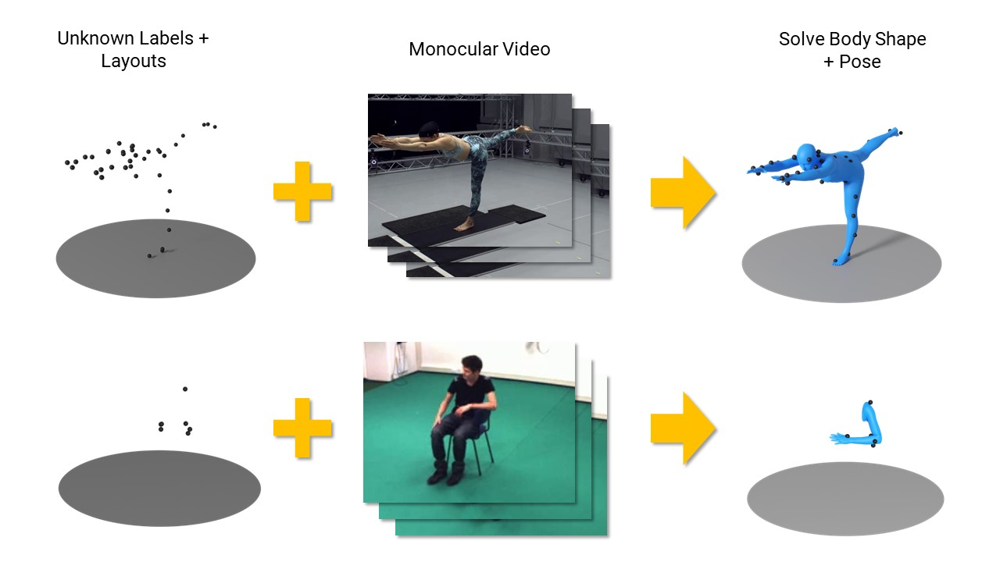

# UUO-Mocap
This is the official repository for *Towards Unstructured Unlabeled Optical Mocap: A Video Helps!* [SIGGRAPH 2024].



## Installation
After cloning this repository, clone submodules:
```
git submodule update --init
```

For easy installation, run the install script:
```
bash install.sh
```

## Dataset/Benchmarks
To preprocess dataset to reconstruct the benchmarks, see the [benchmark instructions](Benchmarks.md).

## Body models
This project uses the male, female, and neutral body models. Download the male/female SMPL models [here](http://smpl.is.tue.mpg.de/)(v.1.0.0) and the neutral model [here](http://smplify.is.tue.mpg.de/). Place the models in this format:
```
body_models
└── smpl
    ├── basicModel_f_lbs_10_207_0_v1.0.0.pkl
    ├── basicModel_m_lbs_10_207_0_v1.0.0.pkl
    └── basicModel_neutral_lbs_10_207_0_v1.0.0.pkl
```

However, to work with the SMPL-X library, these need to be renamed as the following:
```
body_models
└── smpl
    ├── SMPL_FEMALE.pkl
    ├── SMPL_MALE.pkl
    └── SMPL_NEUTRAL.pkl
```

## Visualizations
There are many different visualization scripts. To run our algorithm and render it on screen:
```
 python src/video_mocap/vis/visualize_model.py --subject s1 --sequence brownies_00000150 --dataset cmu_kitchen_pilot_rb --input_dir ./data/ --config config/video_mocap.yaml --gpu 0
```

Because this process is a bit slow, you save view saved results via this command:
```
 python src/video_mocap/vis/visualize_model.py --subject s1 --sequence brownies_00000150 --dataset cmu_kitchen_pilot_rb --input_dir ./data/ --config config/video_mocap.yaml --gpu 0
```

Append a video output filename using the `--video_path` attribute to export to video instead of displaying a window (supports .png, .gif, and .mp4 formats).

## Testing
To generate outputs in SMPL format, use the following command:
```
python src/video_mocap/test/test.py --subject s1 --sequence brownies_00000150 --dataset cmu_kitchen_pilot_rb --input_dir ./data/ --config config/video_mocap.yaml --gpu 0
```

## Citation
If this work was useful or relevant to your research, it would be appreciated if you could cite our work:
```
@inproceedings{milef2024towards,
    title={Towards Unstructured Unlabeled Optical Mocap: A Video Helps!},
    author={Milef, Nicholas and Keyser, John and Kong, Shu},
    year={2024},
}
```

## Contact
If you encounter problems or have questions, please feel free to post an issue or email us!
